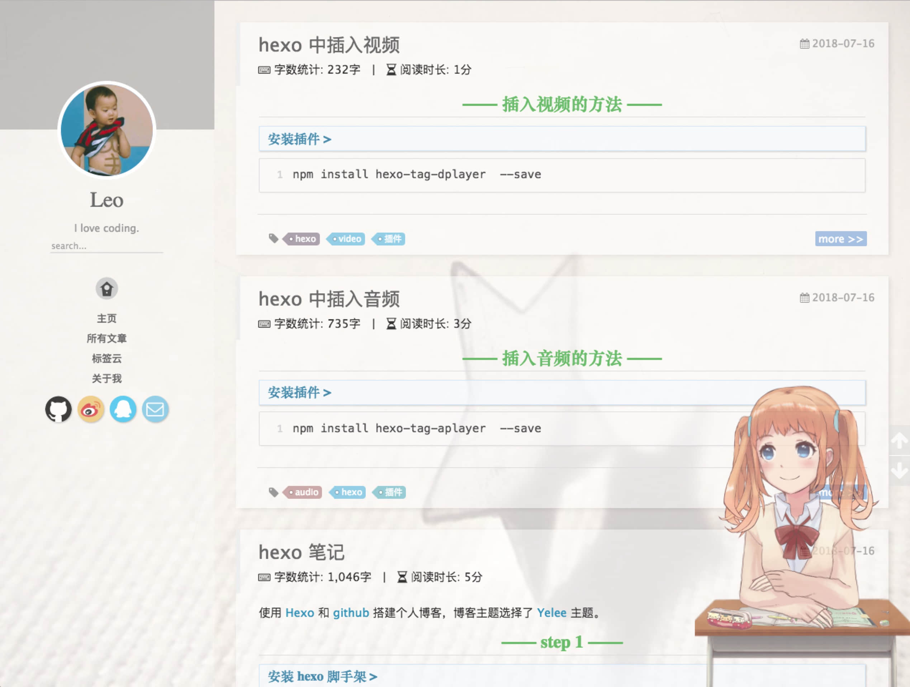

使用 [Hexo](https://hexo.io/) 和 [github](https://github.com/liaoyajun) 搭建个人博客，博客主题选择了 [Yelee](http://moxfive.coding.me/yelee/) 主题。

## step 1

### 安装 hexo 脚手架

``` bash
npm install hexo-cli -g
```
<!--more-->

### 初始化博客

``` bash
hexo init  # 或者简写 hexo i
```

### 生成静态页面

``` bash
hexo generate  # 或者简写 hexo g
```

### 本地启动

``` bash
hexo server  # 或者简写 hexo s
```

### 配置 github

1、建好名为 [user_name.github.io](https://github.com/liaoyajun/liaoyajun.github.io) 的代码仓库

2、安装 hexo 部署 git 依赖模块
``` bash
npm install hexo-deployer-git --save
```

3、修改项目根目录 `_config.yml` 文件 [deploy](https://hexo.io/docs/deployment.html) 参数
``` plain
deploy:
  type: git
  repo: <repository url>
  branch: [branch]
  message: [message]
```

### 部署到 github

``` bash
hexo clean && hexo generate && hexo deploy  # 或者简写 hexo clean && hexo g && hexo d
```

### 其他常用指令

``` bash
hexo new postName # 新建文章
hexo new page postName # 新建页面
```

## step 2

### 设置标签云

1、安装插件
``` bash
npm install hexo-tag-cloud --save
```

### 自定义站点内容搜索

1、安装插件
``` bash
npm install hexo-generator-search --save
```

2、修改项目根目录 `_config.yml` 文件 [search](https://github.com/wzpan/hexo-generator-search) 参数
``` plain
search:
  path: search.xml
  field: post
```

### 博文插入图片

1、安装插件
``` bash
npm install hexo-asset-image --save
```

2、修改项目根目录 `_config.yml` 文件 post_asset_folder 参数
``` plain
post_asset_folder: true
```

3、再运行 `hexo n "xxxx"` 来生成md博文时， /source/\_posts 文件夹内除了 xxxx.md 文件还有一个同名的文件夹

4、在 xxxx.md 中想引入图片时，先把图片复制到 xxxx 这个文件夹中，然后只需要在 xxxx.md 中按照 markdown 的格式引入图片
``` markdown

```

### 添加[来必力](https://livere.com/)评论

1、打开 `theme/yelee/_config.yml` ，添加配置信息
``` plain
livere:
  on: true
  livere_uid: Your uid
```

2、创建评论 `ejs` 文件
在 `themes/yelee/layout/_partial/comments` 文件夹创建 `livere.ejs` 文件，拷贝来必力生成的代码。
``` html
<section class="livere" id="comments">
  <!-- 来必力City版安装代码 -->
  <div id="lv-container" data-id="city" data-uid="Your uid">
    <script type="text/javascript">
      (function(d, s) {
        var j, e = d.getElementsByTagName(s)[0];
        if (typeof LivereTower === 'function') { return; }
        j = d.createElement(s);
        j.src = 'https://cdn-city.livere.com/js/embed.dist.js';
        j.async = true;
        e.parentNode.insertBefore(j, e);
      })(document, 'script');
    </script>
    <noscript>为正常使用来必力评论功能请激活JavaScript</noscript>
  </div>
  <!-- City版安装代码已完成 -->
</section>
```

3、配置文章内的评论部分内容
修改 `themes/yelee/layout/_partial/article.ejs` 文件。
``` html
<% } else if (theme.livere.on) { %>
    <%- partial('comments/livere') %>
<% } else if (theme.youyan.on) { %>
```

### 添加字数统计和阅读时长

1、安装插件
``` bash
npm install hexo-wordcount --save
```

2、调整代码
在 `yelee/layout/_partial/post/word.ejs` 下创建 `word.ejs` 文件
``` html
<div style="margin-top:10px;">
  <span class="post-time">
    <span class="post-meta-item-icon">
      <i class="fa fa-keyboard-o"></i>
      <span class="post-meta-item-text">  字数统计: </span>
      <span class="post-count"><%= wordcount(post.content) %>字</span>
    </span>
  </span>
  <span class="post-time">
    &nbsp; | &nbsp;
    <span class="post-meta-item-icon">
      <i class="fa fa-hourglass-half"></i>
      <span class="post-meta-item-text">  阅读时长: </span>
      <span class="post-count"><%= min2read(post.content) %>分</span>
    </span>
  </span>
</div>
```
然后在 `themes/yelee/layout/_partial/article.ejs` 中添加字数统计代码
``` html
<header class="article-header">
  <%- partial('post/title', {class_name: 'article-title'}) %>
  <% if(theme.word_count && !post.no_word_count){ %>
    <%- partial('post/word') %>
  <% } %>
</header>
```

3、打开 `theme/yelee/_config.yml` ，修改 `word_count` ，如果单篇文章不需要字数统计，可设置 `no_word_count` 为 `false`

### 鼠标点击效果和粒子效果

1、拷贝 `love.js` 和 `particle.js` 到 `themes/yelee/source/resources/` 目录

2、打开 `themes/yelee/layout/_partial/after-footer.ejs` 文件，引入js
``` html
<script async type="text/javascript" src="/resources/love.js"></script>
// 移动端效果差，不引入粒子效果
<script type="text/javascript">
  var flag = (window.navigator.userAgent.toLocaleLowerCase().indexOf('mobile') == -1);
  if (flag) {
    // 不确定其他地方使用 window.onload ，直接延时好了
    setTimeout(function() {
      var theBody = document.getElementsByTagName('body').item(0);
      var myScript = document.createElement('script');
      myScript.src = '/resources/particle.js';
      myScript.type = 'text/javascript';
      myScript.defer = true;
      theBody.appendChild(myScript);
    }, 3000)
  }
</script>
```

### 添加一个萌妹子

1、安装插件 [live2d](https://huaji8.top/post/live2d-plugin-2.0/)
``` bash
npm install hexo-helper-live2d --save
npm install live2d-widget-model-shizuku --save  # 安装具体模型
```

2、添加项目根目录 `_config.yml` 文件 `live2d` 参数
``` plain
live2d:
  enable: true
  scriptFrom: local
  pluginRootPath: live2dw/
  pluginJsPath: lib/
  pluginModelPath: assets/
  tagMode: false
  debug: false
  model:
    use: live2d-widget-model-shizuku
  display:
    position: right
    width: 150
    height: 300
  mobile:
    show: true
```

3、效果图

